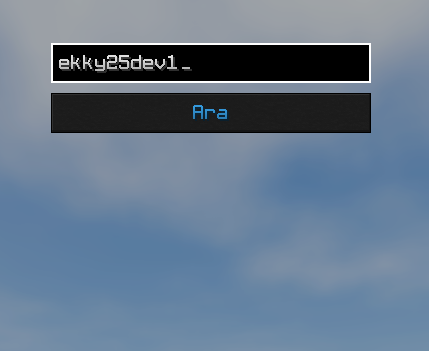
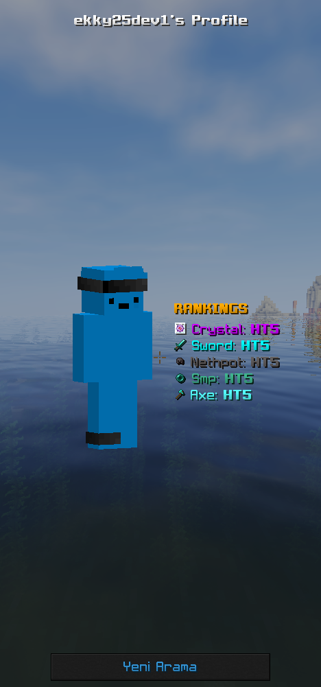

# TrTierListTagger
- ↳ Release 21.1-21.1.2     
  📄 [TrTierListTagger release](https://nightly.link/1Yuqas/TrTierListTagger/workflows/gradle-build.yml/release/TrTierListTagger-Snapshot.zip)
- ↳ 1.21.11    
  📄 [TrTierListTagger 1.21.11](https://nightly.link/1Yuqas/TrTierListTagger/workflows/gradle-build.yml/1.21.11/TrTierListTagger-Snapshot.zip)
- ↳ 1.21.4    
  📄 [TrTierListTagger 1.21.4](https://nightly.link/1Yuqas/TrTierListTagger/workflows/gradle-build.yml/1.21.4/TrTierListTagger-Snapshot.zip)
- ↳ 1.20.4    
  📄 [TrTierListTagger 1.20.4](https://nightly.link/1Yuqas/TrTierListTagger/workflows/gradle-build.yml/1.20.4/TrTierListTagger-Snapshot.zip)
- ↳ 1.20.1    
  📄 [TrTierListTagger 1.20.1](https://nightly.link/1Yuqas/TrTierListTagger/workflows/gradle-build.yml/1.20.1/TrTierListTagger-Snapshot.zip)
----
**Komutlar**
- `/trtiertagger` - TrTierTagger menüsünü açar
- `/trtiertagger <player>` - Oyuncunun Tierlerini görmeniz için menü açar

**Tier Tagger GUI**
-

**Oyuncu Arama**
-

