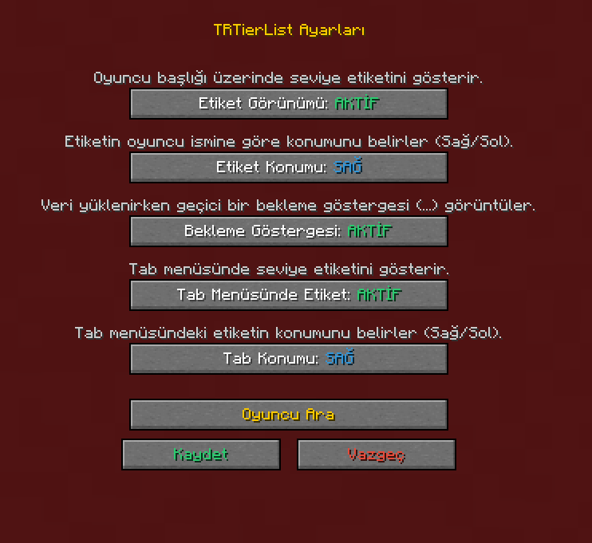
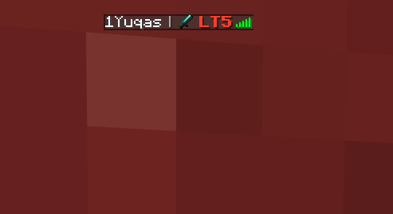
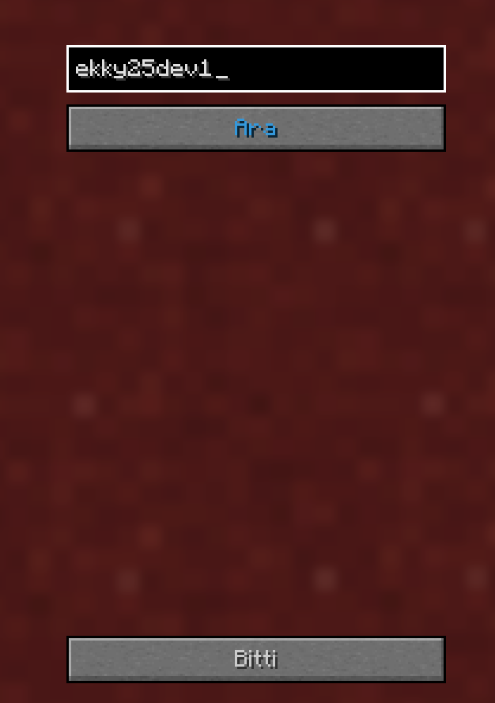
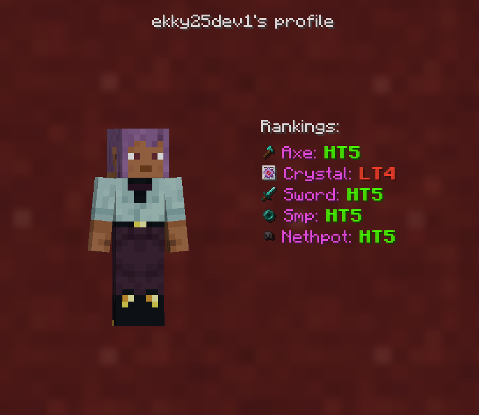

- ↳ **TrTierListTagger**
- ↳ 1.21.11    
  📄 [TrTierListTagger-1.21.11.zip](https://nightly.link/1Yuqas/TrTierListTagger/workflows/Gradle%20Build/1.21.11/TrTierListTagger-Snapshot.zip)
- ↳ 1.21.4    
  📄 [TrTierListTagger-1.21.4.zip](https://nightly.link/1Yuqas/TrTierListTagger/workflows/Gradle%20Build/1.21.4/TrTierListTagger-Snapshot.zip)
- ↳ 1.20.4    
  📄 [TrTierListTagger-1.20.4.zip](https://nightly.link/1Yuqas/TrTierListTagger/workflows/Gradle%20Build/1.20.4/TrTierListTagger-Snapshot.zip)
- ↳ 1.20.1    
  📄 [TrTierListTagger-1.20.1.zip](https://nightly.link/1Yuqas/TrTierListTagger/workflows/Gradle%20Build/1.20.1/TrTierListTagger-Snapshot.zip)
----
**Komutlar**
- `/trtiertagger` - TrTierTagger menüsünü açar
- ` /trtiertagger <player>` - Oyuncunun Tierlerini görmeniz için menü açar

**Tier Tagger GUI**
-

**Taglar**
-

-
**Oyuncu Arama**
-

